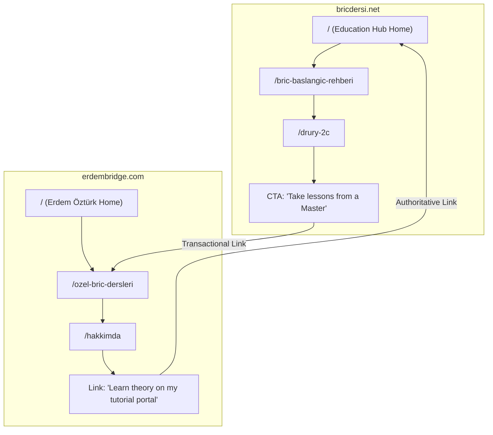

# Multi-Site SEO Strategy: bricdersi.net & erdembridge.com (Revised Edition)

This document establishes the 12-month SEO architecture, content segregation strategy, cross-linking mapping, and E-E-A-T framework to position **bricdersi.net** as Turkey's primary bridge education portal and **erdembridge.com** as the personal brand authority of Milli Takım Antrenörü Erdem Öztürk.

---

## 1. Strategy & Segregation Matrix

To prevent keyword cannibalization and maximize shared topical authority, search intent is split between the two websites:

| Aspect | bricdersi.net (The Education Hub) | erdembridge.com (The Authority Brand) |
|:---|:---|:---|
| **Primary Intent** | Informational (How to play, conventions, rules, terms, PDF notes). | Transactional & Editorial (Hiring a coach, booking private lessons, speaking, elite captain credentials). |
| **Primary Keywords** | "Briç Dersleri", "Briç öğren", "Briç konvansiyonları", "BBO oyna", "Briç kuralları". | "Erdem Öztürk", "Briç Antrenörü", "Özel Briç Dersi", "İstanbul Briç Kursu". |
| **Content Type** | Comprehensive tutorial guides, glossary dictionary, interactive quizzes, video breakdowns. | Biyografi, credentials, student testimonials, course schedules (yüz yüze & online), blog editorials. |
| **Tone** | Objective, pedagogical, structured, community-oriented. | Personal, professional, elite, high-achieving. |

### Search Intent Mapping (Keyword Assignment)
To fully prevent keyword cannibalization, each primary topic and keyword cluster is mapped exclusively to one domain:

| Topic / Keyword | Intended Target Domain | Search Intent Type | Content Asset Mapping |
|:---|:---|:---|:---|
| "Briç öğren", "Briç nasıl oynanır" | **bricdersi.net** | Informational (Beginner) | `/bric-baslangic-rehberi` (Pillar Page) |
| "Briç kuralları", "Briç skor hesaplama" | **bricdersi.net** | Informational | `/bric-puan-hesaplama-ve-skor` |
| "Drury", "Jacoby 2NT", "Fit 2NT" | **bricdersi.net** | Informational (Advanced) | Silo `/bric-konvansiyonlari/` |
| "BBO oyna", "BBO Türkçe" | **bricdersi.net** | Informational / Utility | `/bbo-online-oyun-rehberi` |
| "Erdem Öztürk kimdir" | **erdembridge.com** | Navigational / Brand | `/hakkimda` |
| "Özel briç dersi", "İstanbul briç kursu" | **erdembridge.com** | Transactional | `/ozel-bric-dersleri` |
| "Briç turnuva analizleri" | **erdembridge.com** | Editorial / Blog | `/blog` |

---

## 2. Content Architecture & Pillar Pages

### A. bricdersi.net (Topical Education Hub)
Structured into 3 main content silos:

```
├── /bric-kurallari (Silo 1: Beginners & Rules)
│   ├── /bric-baslangic-rehberi (Pillar Page)
│   ├── /bric-puan-hesaplama-ve-skor
│   └── /bric-oyun-kurallari-ve-deklarasyon
├── /bric-konvansiyonlari (Silo 2: Intermediate & Advanced Conventions)
│   ├── /drury-2c
│   ├── /jacoby-2nt
│   ├── /inverted-minor
│   └── /fit-2nt
└── /bbo-rehberleri (Silo 3: Practical Tools & BBO)
    ├── /bbo-online-oyun-rehberi
    └── /bbo-turkce-masa-ayarlari
```

### B. erdembridge.com (Personal Authority & Booking)
Structured around personal expertise and booking conversion:

```
├── /hakkimda (Personal Biography, National Team history, credentials)
├── /ozel-bric-dersleri (Course booking page - Group, Individual, Corporate)
├── /yorumlar (Social proof: Client testimonials, success stories)
└── /blog (Editorial opinions, tournament review blogs, bridge strategy advice)
```

---

## 3. Natural Cross-Linking & Trust Flow

We leverage a semantic link network to pass PageRank and E-E-A-T credentials between the two sites:



*   **From `bricdersi.net` to `erdembridge.com`:** All lesson pages (e.g., Fit 2NT) contain a subtle, high-converting call-to-action (CTA): *"Bu konvansiyonu pratik ederek öğrenmek ister misiniz? Milli Takım Antrenörü Erdem Öztürk'ten [Özel Briç Dersleri](https://www.erdembridge.com/ozel-bric-dersleri) alın."*
*   **From `erdembridge.com` to `bricdersi.net`:** The biography/experience page references the educational portal: *"Briç sporunun gelişmesi ve teorik eğitim notlarına kolay ulaşılması amacıyla kurduğum [bricdersi.net](https://bricdersi.net) portalını ziyaret ederek ücretsiz kaynaklara erişebilirsiniz."*

### Internal Linking Rules
The following structural links must be maintained to distribute PageRank and trust signals:
1.  **Pillar & Cluster Connections:**
    *   Every cluster page (e.g. `/bric-puan-hesaplama-ve-skor`) must link back to its parent pillar page (e.g. `/bric-baslangic-rehberi`).
    *   Every pillar page must link out to all relevant cluster pages in its silo.
2.  **New Content Integration:**
    *   Every new article published must contain links to at least **3 existing articles** in the same domain cluster to prevent orphaned pages.
3.  **Cross-Domain Protocol:**
    *   Links between `bricdersi.net` and `erdembridge.com` must be natural, contextual, and only deployed when they add clear value to the user (e.g. educational CTA or author citation). Do not use sitewide footer cross-links.

---

## 4. Google-Compliant Schema Strategy

### A. bricdersi.net (Educational Hub Schema)
*   **Do NOT use Course Schema on informational guide pages:** Informational articles (e.g. Fit 2NT or Drury explanation) must use `TechArticle` or `WebPage` schema, not `Course` schema, to avoid Google Rich Result penalties.
*   **`Course` Schema:** Restrict strictly to actual, purchasable course options (e.g., online class subscription packages) containing valid `provider` and `offers` fields.
*   **`TechArticle` & `WebPage` Schema:** Applied to specific convention explanations and rules pages.
*   **`FAQPage` Schema:** Leveraged on pages containing FAQ accordions, enabling SERP rich snippets.
*   **`HowTo` Schema:** Placed ONLY on true step-by-step procedural tutorials (e.g., *"How to Register on BBO"* or *"How to Setup a Table on BBO"*), not on conceptual or bidding convention explanations.
*   **`BreadcrumbList` Schema:** Implemented on all subpages to map the hierarchical path (e.g., *Home -> Rehber -> Drury*).

### B. erdembridge.com (Personal Authority Schema)
*   **`Person` Schema:** Contains rich sameAs fields pointing to external author authority signals (Udemy profile, official TBF coach registries, social media profiles).
*   **`LocalBusiness` Schema:** Applied on the homepage to capture local search visibility.
*   **`Review` Schema Compliance:** Google's current guidelines restrict self-serving reviews. All reviews must be authored by real clients and nested within the `LocalBusiness` entity without using aggregate rating markups on pages where reviews are not directly generated by users on-site.

---

## 5. Webmaster Console, Tracking & Analytics

### A. Core Integrations
*   **Google Search Console (GSC):** Separate GSC properties configured for both domains to monitor index coverage, search query CTRs, and submission paths.
*   **Google Analytics 4 (GA4):** Independent tracking IDs set up to monitor user engagement metrics (session length, user journeys, scrolls, conversion events).
*   **Microsoft Clarity:** Installed on both sites to record heatmaps and session recordings, diagnosing potential user friction points (e.g. navigation confusion or quiz errors).
*   **Bing Webmaster Tools & Yandex Webmaster:** Sitemap indexing configurations submitted to Bing and Yandex to maximize international organic visibility.

### B. Monthly Monitoring & Verification Checklist
1.  **Sitemap Submission:** Re-submit `sitemap.xml` in GSC if routes change.
2.  **Crawl Error Monitoring:** Inspect GSC coverage reports for 404s, redirect chains, or server timeouts.
3.  **Index Coverage Check:** Ensure all 12 generated static directories are indexable (green status) in GSC.
4.  **Clarity Session Audits:** Review top user paths to optimize CTAs.

---

## 6. Local SEO (erdembridge.com)

*   **Google Business Profile (GBP):** Verify and claim a Google Business Profile named *"Erdem Öztürk Özel Briç Dersleri"*.
*   **NAP Consistency (Name, Address, Phone):** Ensure the business Name, physical Address (Levent Tenis Kulübü, Beşiktaş, İstanbul), and Phone Number (`+90 536 853 32 84`) match exactly across the website footer, contact pages, GBP, and local directory citations.
*   **LocalBusiness Optimization:** Inject schema matching the NAP details, geo-coordinates, and opening hours specifications.
*   **Local Citations:** Register the profile on local directories (Yandex Haritalar, Apple Maps, Foursquare).
*   **Location Landing Pages:** Target Beşiktaş/Levent search intent with specialized landing headers: *"Beşiktaş Levent'te Yüz Yüze Briç Dersleri"*.

---

## 7. Video SEO & YouTube Strategy

Integrate a dedicated YouTube channel to build topical authority and drive organic traffic:

*   **Video → bricdersi.net (Educational):** Link matching YouTube tutorials directly from convention pages.
*   **Video → erdembridge.com (Authority):** Link student success testimonials and coach vlogs from the biography page.
*   **VideoObject Schema:** Mark up every embedded video with schema containing name, description, duration, uploadDate, thumbnailURL, and contentURL.
*   **Transcript Optimization:** Write keyword-rich transcripts for YouTube to improve visibility in native YouTube searches and Google Video search tab.
*   **Embedding Strategy:** Lazy-load YouTube iframes using custom placeholders to maintain high Core Web Vitals and low PageSpeed load times.
*   **Cross-Linking:** Insert links to the corresponding website article in the first line of the YouTube video descriptions.

---

## 8. Realistic Link Building & Outreach

Remove Wikipedia backlink strategies to avoid span blocks. Implement professional, high-quality niche partnerships:
*   **TBF Link Acquisition:** Request listing and links from the official TBF coaches directory pointing to `erdembridge.com`.
*   **Bridge Clubs & Hubs:** Secure contextual links from regional bridge clubs (e.g., Majör Boğaziçi Briç Kulübü) referencing `bricdersi.net` as their official study material provider.
*   **Universities & Student Clubs:** Partner with university bridge clubs (ODTÜ, Boğaziçi) by providing free study guides on `bricdersi.net` in exchange for club page backlinks.
*   **Educational Guest Columns:** Write articles for online educational portals and local community blogs.
*   **Interviews & Podcasts:** Participate in mind-sports podcasts and chess/bridge news blogs, citing website links in the show notes.

---

## 9. E-E-A-T & Author Quality

*   **Author Profile Page:** Create a dedicated author page for Erdem Öztürk outlining his teaching experience, that he attended ODTÜ, certified TBF credentials, and tournament records.
*   **Editorial Policy:** Publish an explicit editorial guidelines page detailing how content is researched, written, and verified.
*   **Content Update Policy:** Display a clear *"Last Reviewed / Updated on [Date]"* tag on all guides.
*   **Expert Citations:** Link to official TBF rules PDFs and tournament records.
*   **Real Tournament Experience:** Embed scans of tournament certificates, national team rosters, and award lists.

---

## 10. Content Maintenance & Freshness Policy

*   **Freshness Schedule:** Audit and update the top 6 informational guides quarterly to align with changes in conventions or BBO configurations.
*   **Content Pruning:** Annually improve or merge thin pages that capture zero search impressions before considering removal to concentrate domain authority.
*   **Internal Link Audits:** Use crawl scripts to inspect and repair broken internal links or stale cross-links.
*   **Evergreen Content Protection:** Keep core glossary terms and beginning guides static while updating examples and quizzes to maintain search rank rankings.

---

## 11. Recurring Technical SEO Audits

The following technical checks must be executed monthly:
*   **Lighthouse:** Verify Mobile Performance score remains > 90.
*   **Rich Results Test:** Run generated schemas through Google's Rich Results tool to verify structured data parsing.
*   **W3C HTML Validation:** Audit code quality to fix unclosed tags or syntax issues.
*   **PageSpeed Insights:** Check LCP, INP, and CLS scores.
*   **Broken Link Checking:** Verify all internal and outgoing links are operational (200 OK).

---

## 12. 12-Month Roadmap (Revised)

### Quarter 1: Foundation & Authority Segregation
*   Deploy the SSG pipeline with aligned canonical domains.
*   Setup GA4, GSC, and Microsoft Clarity tracking on both sites.
*   Claim and verify Google Business Profile.

### Quarter 2: Schema Deployment & Outreach
*   Deploy `TechArticle`, `HowTo`, and compliant `LocalBusiness` schemas.
*   Begin university club outreach.
*   Verify NAP consistency across citations.

### Quarter 3: Video Integration & EEAT Policy
*   Deploy VideoObject schemas and embed lazy-loaded YouTube guides.
*   Add Editorial Policy and Author biography landing profiles.

### Quarter 4: Content Audit & Freshness Run
*   Execute the first quarterly content freshness update.
*   Audit index coverage status in GSC.
