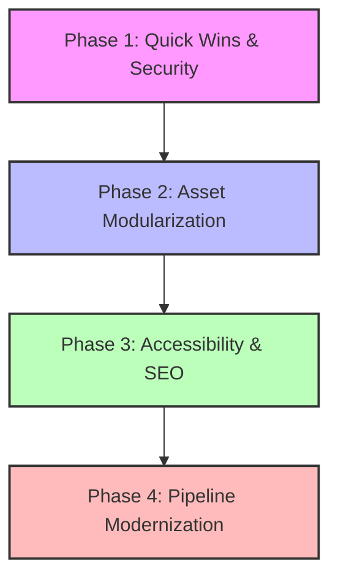

# Project Roadmap

This roadmap outlines the recommended path for future development. It is structured into logical phases, balancing security requirements, performance goals, SEO gains, and architectural scalability.

---

## Roadmap Overview

---

## Phase 1: Quick Wins & Security
* **Objective:** Fix immediate vulnerabilities and complete low-risk configuration updates.

### 1.1 Hash Passcode Verification (SEC-01)
* **Description:** Hash the lock screen passcode using SHA-256 instead of comparing a raw string literal.
* **Dependencies:** None.
* **Complexity:** Low (1-2 hours).
* **Expected Impact:** **Critical Security** (prevents simple inspect-source password theft).
* **Implementation Risk:** Low. Ensure local storage keys remain aligned.

### 1.2 Session Token Storage (SEC-02)
* **Description:** Move the GitHub personal access token from `localStorage` to `sessionStorage` or prompt for it on editor launch to prevent persistent token exposure.
* **Dependencies:** None.
* **Complexity:** Low (1 hour).
* **Expected Impact:** **High Security** (restricts XSS vulnerability window).
* **Implementation Risk:** Low. Users will need to paste the token per-session.

### 1.3 Domain Name Migration (SEO-02)
* **Description:** Migrate all hardcoded `erdembridge.com` links and tags to `bricdersi.net` (canonical links, schema JSON-LD metadata, and title attributes).
* **Dependencies:** Final domain setup confirmation.
* **Complexity:** Low (1 hour).
* **Expected Impact:** **Critical SEO** (aligns index authority to `bricdersi.net`).
* **Implementation Risk:** Low.

---

## Phase 2: Asset Modularization & Performance
* **Objective:** Shrink DOM size, enable resource caching, and decouple code assets.

### 2.1 Extract Base64 Image Assets (PER-01)
* **Description:** Save the 7 large base64 image strings as separate SVG/PNG files in `/assets/images/` and update references in `index.html`.
* **Dependencies:** None.
* **Complexity:** Medium (3-5 hours).
* **Expected Impact:** **High Performance** (reduces initial HTML load from 575 KB to ~150 KB, enabling parallel asset streaming and browser caching).
* **Implementation Risk:** Low. Verify image paths load correctly on staging.

### 2.2 Split CSS & JS files (MNT-01)
* **Description:** Extract 38 KB of inline styles to `assets/css/styles.css` and 24 KB of inline Javascript logic to `assets/js/app.js`.
* **Dependencies:** Asset extraction (2.1).
* **Complexity:** Medium (4-6 hours).
* **Expected Impact:** **High Maintainability** (separates concerns, enables clean syntax linting).
* **Implementation Risk:** Medium. Watch for scope collisions due to variable binding context changes.

---

## Phase 3: Accessibility & SEO Enhancements
* **Objective:** Optimize user experience for crawler bots and keyboard navigation.

### 3.1 Keyboard Accessibility (ACC-01)
* **Description:** Add `tabindex="0"`, focus states, and keydown handlers (Space/Enter) to all custom quiz options, BBO Bidding Box buttons, and tab headers.
* **Dependencies:** None.
* **Complexity:** Medium (6-8 hours).
* **Expected Impact:** **High Accessibility** (enables full keyboard navigation compliance under WCAG guidelines).
* **Implementation Risk:** Low.

### 3.2 Server-Side Pre-rendering (SEO-01)
* **Description:** Serve static HTML files populated with SEO titles and meta tags for specific routes (e.g. `/bric-baslangic-rehberi`) using Firebase rewrite overrides.
* **Dependencies:** Domain Migration (1.3).
* **Complexity:** High (12-16 hours).
* **Expected Impact:** **High SEO Discovery** (allows crawler bots that bypass JS execution to index guides individually).
* **Implementation Risk:** Medium. Synchronize pre-rendered meta headers with SPA client logic.

---

## Phase 4: Pipeline Modernization
* **Objective:** Standardize development flow for long-term project expansion.

### 4.1 Bundle Setup (Vite / npm)
* **Description:** Standardize the workspace as a Node.js project. Setup Vite, configure build paths, and transition code blocks to ES Modules imports/exports.
* **Dependencies:** Asset splitting (2.2).
* **Complexity:** High (16-20 hours).
* **Expected Impact:** **Critical Scalability & Maintainability** (unlocks dependency managers, modern bundlers, and developer utilities).
* **Implementation Risk:** High. Require regression testing to ensure no global scope bindings break.

### 4.2 Secure Token Proxy (Firebase Cloud Functions)
* **Description:** Create a Firebase Cloud Function proxy to perform GitHub writes securely. Frontend sends requests to this function, which appends repository tokens securely from environment variables.
* **Dependencies:** None.
* **Complexity:** High (10-12 hours).
* **Expected Impact:** **Critical Security** (fully hides GitHub API access tokens from the browser).
* **Implementation Risk:** Medium.
